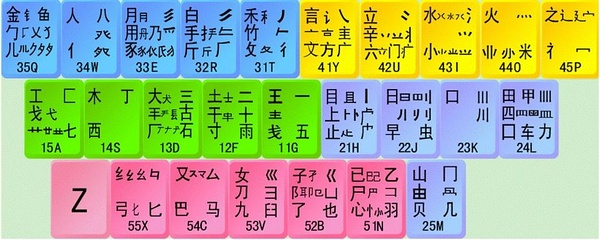
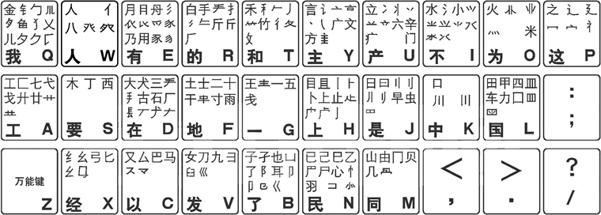

# 五笔

参考链接：[知乎帖](https://www.zhihu.com/question/19816777)、[豆瓣帖](https://www.douban.com/note/218182753/)

[TOC]

## 一、分区

| 区位                     | 字母                            |
| ---------------------- | ----------------------------- |
| 一区（横区，左手五键。从食指到小指，下同）： | G(11) F(12) D(13) S(14) A(15) |
| 二区（竖区，右手五键）：           | H(21) J(22) K(23) L(24) M(25) |
| 三区（撇区，左手上五键）：          | T(31) R(32) E(33) W(34) Q(35) |
| 四区（捺/点区，右手上五键）：        | Y(41) U(42) I(43) O(44) P(45) |
| 五区（折区，左手下五键）：          | N(51) B(52) V(53) C(54) X(55) |

### 图示 :

## 二、规则
### 1、主要规则
【规则0】：字根是构成汉字的基本单位，按笔顺可将一个字拆成若干字根，比如“汉”可拆成“氵"、"又”，“本”可拆成“木“、”一”，“单”可拆成“两点”、“日”、“十”。
【规则1】：字根的第一笔在哪个**区**，第二笔在哪个**位**，就在哪个键。比如字根"土"：第一笔横，第二笔竖，所以在横区竖位的键——F(12)键；字根“儿”，第一笔撇，第二笔折，所以在撇区折位的键——Q(35)键。
（横区=1区，竖区=2区，撇区=3区，捺/点区=4区，折区=5区；
横位=1位，竖位=2位，撇位=3位，捺/点位=4位，折位=5位）
【规则2】：字根与其字形相近的字根在同一键。比如“五”与“王”相近，所以在G(11)
【规则3】：同一笔划构成的字根，笔划类型在哪个区，笔划数在哪个位，就在哪个键。比如“一”在G(11)，“二”在F(12)，“三”在D(13)

成字字根：首先报户口（比如说我要打“彳”，“彳”在T键），然后按这个字根的书写顺序输入笔划，“彳”分别由“丿”，“丿”，“丨”组成，所以就是TTTH。（若遇见多笔划的成字字根，比如你问的戋，先报户口，再输入第二划，第三划，和最后一划即可。）若笔画多，则最后一个字母代表最后一笔，例如“西”，西s、一g、|h、一（最后一笔）g

### 2、特殊记忆

2区各位的首字口诀“H目 J日 K口 L田 M山”

㐅Q

廿 同艹 A

K：口、川

W：人、八、登字头、祭字头

F：土、干、二、千、十、寸、雨

## 三、键位图示

## 四、口诀
### 1、升级版
G：王旁青头戋(兼)五一
F：土士二干十寸雨，（一二还有革字底）
D：大犬三羊古石厂，（羊有直斜套去大）
S：木丁西
A：工戈草头右框七
H：目具上止卜虎皮
J：日早两竖与虫依
K：口与川，字根稀
L：田甲方框四车力
M：山由贝，下框几，（二五还有骨字头）
T：禾竹一撇双人立，反文条头共三一
R：白手看头三二斤
E：月彡(衫)乃用家衣底，（爱头豹头和豹尾，舟下象身三三里）
W：人八登祭取字头
Q：金勺缺点无尾鱼，犬旁留乂儿一点夕，氏无七
Y：言文方广在四一，高头一捺谁人去
U：立辛两点六门疒(病)
I：水旁兴头小倒立
O：火业头，四点米
P：之字军盖道建底，摘礻(示)衤(衣)
N：已半巳满不出己，左框折尸心和羽
B：子耳了也框向上
V：女刀九臼山朝西
C：又巴马，丢矢矣
X：慈母无心弓和匕，幼无力

### 2、解读

口诀中的大部分字根都能应用此4条规则，不能应用的只有用【】标识的部分，非常少：
G：王旁青头戋(兼)五一
“王”、“青头”、“戋”：R1；“五”：R2；“一”：R3。
代表字：“呈”=“口”+“王”，青=“青头”+“月”，“栈”=“木”+“戋”，“吾”=“五”+“口”，“旦”=“日”+“一”
F：土士二干十寸雨，（一二还有革字底）
“土”、“士”、“干”、“十”、”寸“、”雨“：R1；“二”：R3；”革字底“：R2。
代表字： ”地“=”土“+”也“，”吉“=”士“+”口“，”元“=”二“+”儿“，”旱“=”日“+”干“，”协“=”十“+”力“+”八“，”村“=”木“+”寸“，”雷“=”雨“+”田“，”鞋“=”廿“+”革字底“+"土"+“土”
D：大犬三羊古石厂，（羊有直斜套去大）
“大”，“犬”，“石”，“厂”：R1；“三”：R3；“古“，”“羊底”，“套底”：R2。
代表字：“套”=“大”+“套底”，“吠”=“口”+“犬”，“耒”=“三”+“小”，“羊”=“两点”+“羊底”，“胡“=”古“+”月“，”矿“=”石“+”广“，”仄“=”厂“+”人“，”着“=”两点“+”羊底“+”目“
S：【木丁西】
代表字：“栖”=“木”+“西”，“可”=“丁”+“口”
A：工戈【草头】右框七
“戈”，“匚”，“七”：R1；“工”：R2。
代表字：”贡“=”工“+”贝“，“伐”=“人”+“戈”，“草”=“艹”+"早"，”叵“=”匚“+”口“，”虎“=”虎字头“+”七“+"几"
H：【目具】上止卜虎皮
”上“、”止“，”虎头“：R1；”卜“，”皮头“：R3。
代表字：”盯“=”目“+”丁“，”具“=”具头“+”八“；”让“=”讠“+”上“，”肯“=”止“+”月“，”讣“=”讠“+”卜“，”虎“=”虎头“+“七”+“几”，“皮”=“皮头”+“又”
J：【日早】两竖与【虫】依
刂：R3。
代表字：“旦”=“日”+“一”，“草=“艹”+“早”，“井”=“二”+“刂”，“蚊”=“虫”+“文”
K：【口】与川，字根稀
川：R3.
代表字：“回“=”囗“+”口“，”卅“=”一“+”川“
L：【田甲方框四车力】
代表字：”男“=”田“+”力“，”岬“=”山“+”甲“，”回“=”囗”+“口”，“罗”=“四”+“夕”，“轧”=“车”+“乙”
M：山由贝，下框几，（二五还有骨字头）
"山"，"由"、“贝”，“冂”：R1；“几”，“骨头”：R2。(150907fix)
代表字：“岬”=“山”+“甲”，”岫“=”山“+”由“，“贡”=“工”+“贝”，“同”=“冂”+“一”+“口”，“凡”=“几”+“点”，“骨”=“骨头”+“月”
T：禾竹一撇【双人】立，反文条头共三一
“禾”，“竹”，“攵”：R1；“条头”：R2；“撇”：R3。
代表字：“和”=“禾”+“口”，“竺”=“竹字头”+“二”，“千”=“撇”+“十”，“行”=“双人旁”+“二”+“丨”，“孜”=“子”+“攵”，“条”=“条头”+“木”
R：白手看头三二斤
“白”：R1；“手”，“看头”，“斤”：R4。
代表字：“皇”=“白”+“王”，“扒”=“扌”+“八”，“看”=“看头”+“目”，“析“=”木“+”斤“
E：【月】彡(衫)【乃用家衣底】，（爱头豹头和豹尾，舟下象身三三里）
“彡”：R3。
代表字：”肯“=”止“+”月“，”须“=”彡“+”页“，”奶“=”女“+”乃“，”拥“=”扌“+”用“，”家“=”宀“+”豕“，“衣”=“点横”+“衣底”，”爱“=”爱头“+”冖“+“大”+“又”，“豹”=“豹头“+”豹尾“+”勹“+”点“，”舟“=”撇“+”舟下“，”象“=”色头“+”日“+”象身“
W：人八登祭取字头
“人”，“八”：R1；“登头”，“祭头”：R2。
代表字：“谷”=“八”+“人“+“口”，“仁”=“亻”+“二”，“登“=”登头“+”一“+”口“+”两点横“，”祭“=”祭头“+”二“+”小“
Q：【金】勺缺点无尾鱼，犬旁留【乂】儿一点夕，氏无七
勹、鱼头、犬旁、留左上、儿、夕去点、氏无七：R1
代表字：“钋”=“钅“+“卜”，“勺”=“勹”+“点”，”鱼“=”鱼头“+”一“，”猫“=”犬旁去撇“+”撇“+”艹“+”田“，”义“=”一点“+”乂“，”夕“=“夕去点”+“点”，“氏”=“氏去七”+“七”
Y：言文方广在四一，高头一捺【谁人去】
”言“，”文“，”方“，”广“，”高头“：R4；”捺“：R3。
代表字：”访“=”讠“+”方“，”吝“=”文“+”口“，”床“=”广“+”木“，”高“=”高头“+”冂“+”口“，”谁“=”讠“+”亻“+”谁去讠亻“
U：立辛两点六【门】疒(病)
”立“，”辛“，”六“，”疒“，R4；”两点“：R3。
代表字：”音“=”立“+”日“，”辣“=”辛“+”一“+”口“+”小“，”冰“=”冫“+"水"，”问“=”门“+”口“，”病“=”病头“+”一“+”冂“+”人“
I：水旁兴头小倒立
“氵”，“兴头”，“小倒立”：R3。
代表字：”汪“=”三点水“+”王“，”兴“=”兴头“+”八“
O：火业头，四点米
“火”：R4；“业头”，“灬”，“米”：R3
代表字：”灶“=”火“+”土“，”业“=”业头“+”横“，”杰“=”木”+”灬“，“来”=“一”+“米”
P：【之字军盖道建底，摘礻(示)衤(衣)】
代表字：”字“=“字头“+”子“，“军”=“军头”+“车”，“道”=“两点横”+“撇”+“目”+“道底”，“延“=”撇“+”止“+”建底“，”社“=”示旁去点“+“点”+“土”，“衬”=“衣旁去两点”+“两点”+“寸”
N：已半巳满不出己，左框折尸【心和羽】
”已“，”巳“，”己“，”左框“，”尸“：R1；”折“：R3
代表字：“辟”=“尸”+“口”+“辛”，“思”=“田”+“心”；“诩”=“讠”+“羽”
B：子耳了也框向上
”子“，”了“，”也“，”凵“：R1；”卩“，”阝“，耳：R4
代表字：“好“=”女“+”子“，”咠”=“口”+“耳”，“邓”=“又”+“阝”，“却”=“土”+“厶”+“卩”，“辽”=“了”+“之”，“她”=“女”+“也”，“凶”=“乂”+“凵”
V：【女】刀九【臼山朝西】
”刀“，”九“：R1
代表字：“如”=“女”+“口”，“召”=“刀”+“口”，“叴”=“九”+“口”，“舅“=”臼“+”田“+”力“，”雪“=”雨“+”彐“
C：又【巴马】，丢矢矣
”又“，”厶“：R1
代表字：”叹“=”口“+”又“，”吧“=”口“+”巴“，”吗“=”口“+”马“，”弘”=”弓“+“厶”
X：慈母无心【弓】和【匕】，幼无力
“幺”，“母框”：R1
代表字：”慈“=”两点横“+”幺“+“幺”+“心”，“细”=“绞旁”+“田”，“母”=“母框”+“横”+“两点”，“弘”=“弓”+“厶”，“旨”=“匕”+“日”

## 五、其他说明

###1. 多字根汉字的输入：
   有些字包含的字根大于3个，只需输入前三字根和末字根，比如“鹰”=“广”+"人"+"人"+“谁去讠亻”+“勹”+“点”+“折”+“横”，取前三和末字根后：“鹰”=“广”+"人"+"人"+“横”=“YWWG”
###2. 字根汉字的输入：
   有些字本身就是字根，不能再拆分，需要特殊输入，原则是：“字根所在键”+“字根笔画”（GHTYN分别代表横竖撇捺折，如果字根笔画大于2，只需输入前两笔画和末笔画），比如：
   “又”=“C”+“折”+“捺”=“CNY”
   "巴"="C"+"折"+“竖”+“折”=“CNHN”
   “马”=“C”+"折"+“折”+“横”=“CNNG”
###3. 末笔识别码的辅助输入：
   单纯靠字根拆分编码，会存在部分字编码相同，比如“叹”，“吧”，“吗”的字根码都是K("口")+C（“又巴马”），所以五笔新加了末笔识别码规则做为辅助输入，以减少重码率。
   简单来说就是，末笔识别码=汉字最后一笔+汉字的结构，汉字最后一笔决定区号（横竖撇捺折=>12345），汉字结构决定位号（左右，上下，其他=>123），区号+位号确定了末笔识别码，比如：
   “汉”=“氵”+“又”+“Y”（末笔为捺，在4区，左右结构，在1位，41=>Y）
   “字”=“宀”+“子”+”F“（末笔为横，在1区，上下结构，在2位，12=>F）
   "回“=“囗”+”口“+”D“（末笔为横，在1区，其他结构，在3位，13=>D）
   “叹”=“口”+“又”+“Y”
   “吧”=“口”+“巴”+“N”
   “吗”=“口”+“马”+“G”
###4. 词组的输入：
   对于二字词组，只需输入每字的前两字根即可，比如“词组“=（”讠“+”折“+"一"+“口”）+（”幺“+”月“+“一”）=”讠“+”折“+”幺“+”月“=“YNXE”
   对于三字词组，只需输入前两字的第一字根，后一字的前两字根即可，比如“共和国”=（“艹”+“八”）+（“禾”+”口“）+（”囗“+”王“+”点“）=“艹”+“禾”+”囗“+”王"="ATLG"
   对于四字及以上词组，只需输入前三字的第一字根，最后一字的第一字根即可，比如“中华人民共和国”=“口”+“亻”+“人”+“囗”="KWWL"